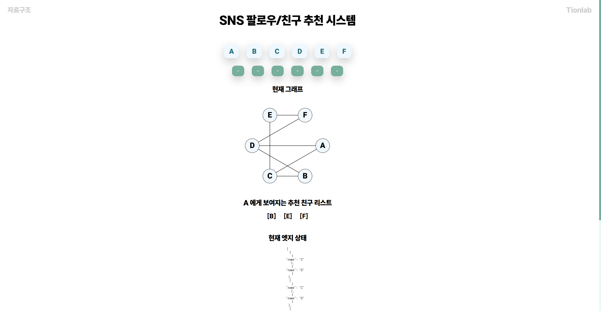

# SNS 팔로우/친구 추천 시스템

이 프로젝트는 사용자가 서로 팔로우하고 연결을 기반으로 친구 추천을 받을 수 있는 간단한 자료구조 소셜 네트워크 그래프를 구현합니다.

## 소개



이 프로젝트는 소셜 네트워크 그래프를 시각화하는 React 기반 애플리케이션입니다.
<br/>
사용자는 사용자를 선택하고 친구를 추가하며 친구 추천을 받을 수 있습니다.
<br/>
그래프는 동적으로 업데이트되어 캔버스에 표시됩니다.

## 기능

-   **그래프 시각화**: 노드와 엣지로 소셜 네트워크 그래프를 시각화합니다.
-   **친구 추천**: 상호 연결을 기반으로 친구 추천을 받습니다.
-   **동적 업데이트**: 사용자가 친구를 추가할 때 그래프가 실시간으로 업데이트됩니다.

## 설치

이 프로젝트를 시작하려면 다음 단계를 따르세요:

1. **저장소 클론**:

    ```bash
    git clone https://github.com/tionlab/FriendGraph.git
    cd sns-follow-recommendation
    ```

2. **의존성 설치**:

    ```bash
    npm install
    ```

3. **개발 서버 시작**:

    ```bash
    npm run dev
    ```

## 사용법

개발 서버가 실행되면 브라우저를 열고 `http://localhost:3000`으로 이동하세요.

-   **사용자 선택**: 사용자 버튼(A, B, C, D, E, F)을 클릭하여 사용자를 선택합니다.
-   **친구 추가**: 친구 버튼을 클릭하여 선택한 사용자에게 친구를 추가합니다.
-   **A에 대한 친구 추천**: 사용자 A에 대한 친구 추천이 그래프 아래에 표시됩니다.

## 기여

이 프로젝트를 개선하기 위한 기여를 환영합니다!
<br/>
제안 사항이 있거나 문제를 발견하면 이슈를 열거나 풀 리퀘스트를 제출해 주세요.

## 라이선스

이 프로젝트는 MIT 라이선스에 따라 라이선스가 부여됩니다.<br/>
자세한 내용은 [LICENSE](LICENSE) 파일을 참조하세요.
